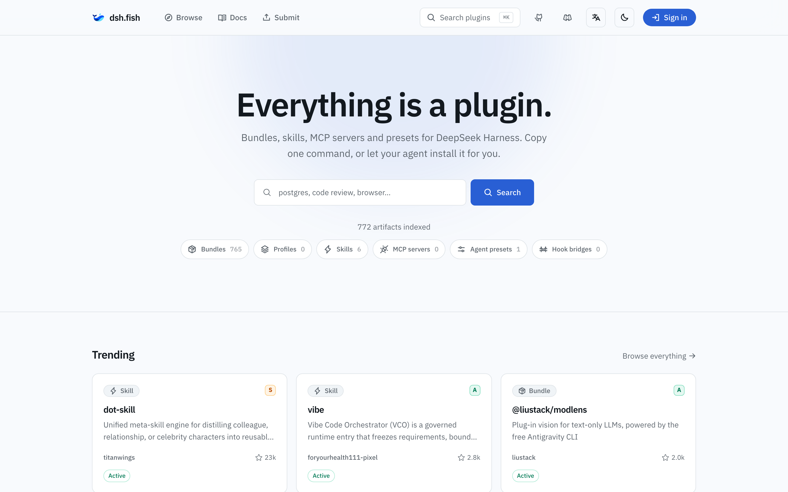
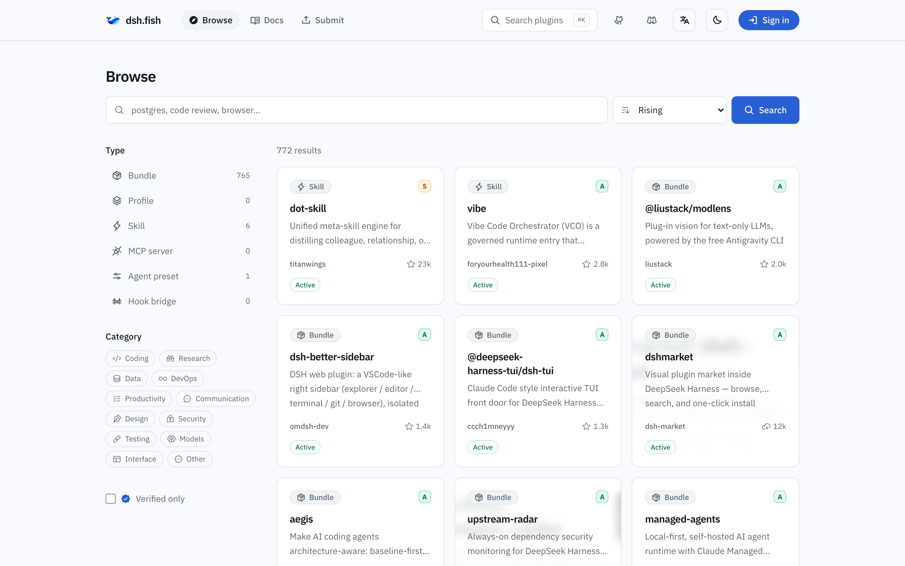
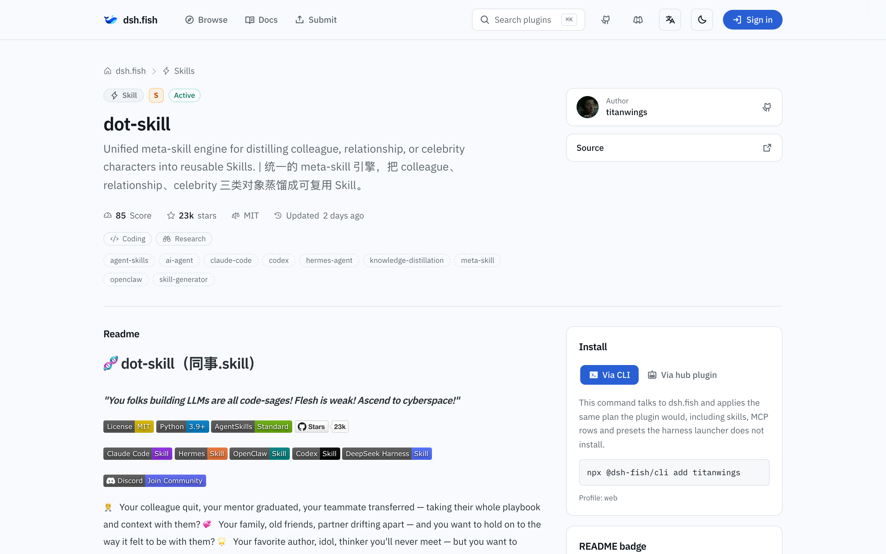

<div align="center">
  
  <h1>dsh.fish</h1>
  <p><strong><a href="https://github.com/deepseek-ai/deepseek-harness">DeepSeek Harness</a> のためのプラグインレジストリ。<br/>Web から、ターミナルから、エージェントから — プラグインを発見し、信頼し、インストールする。</strong></p>

  <p>
    <a href="https://dsh.fish"></a>
    <a href="https://github.com/stvlynn/dsh.fish/actions/workflows/ci.yml"></a>
    <a href="https://www.npmjs.com/package/@dsh-fish/cli"></a>
    <a href="LICENSE"></a>
    <a href="https://discord.gg/PwZDHH4mv3"></a>
  </p>

  <p>
    <a href="README.md">English</a> · <a href="README.zh-CN.md">简体中文</a> · <strong>日本語</strong>
  </p>

  <picture>
    <source media="(prefers-color-scheme: dark)" srcset=".github/assets/home-dark.png" />
    
  </picture>
</div>

---

DeepSeek Harness は「すべてはプラグインである」という思想の上に構築されていますが、
レジストリは付属していません。公式 README は作者にリポジトリへ `dsh-plugin`
トピックを付けるよう求めるだけで、発見の仕組みはそこで終わっています。dsh.fish は
そのトピックを、検索可能で多言語対応のカタログへと変え、機械実行可能な共通の
インストールプランを提供します。

## 特徴

- **型付きカタログ** — バンドル、プロファイル、スキル、エージェントプリセットを、自己申告のタグではなく、ハーネスが実際にロードできるものをプローブして分類します。
- **透明な信頼シグナル** — すべてのアーティファクトに、公開かつ再現可能な品質スコア（S/A/B/C）、メンテナンス状況、7 日 / 30 日のスター増加速度が付与されます。計算式は [`GET /api/v1/scoring`](https://dsh.fish/api/v1/scoring) で公開されており、ブログ記事に埋もれてはいません。
- **人気だけでなく、上昇中も** — スイープごとのメトリクススナップショットをもとにした `rising` ソートで、今週スターを伸ばしているものを浮かび上がらせます。
- **1 つのインストールプラン、3 つのサーフェス** — ドメインが所有する同一のプランが、Web 上ではコピー可能なコマンドとして表示され、CLI では実行され、ハブプラグイン経由でハーネス内でも動作します。互いにずれることはありません。
- **コミットでピン留めされた来歴** — 各アーティファクトには、インデックスされた正確なコミットが表示され、GitHub へのリンクが付いています。
- **ハーネス発のコミュニティ評価** — コメント付きの 1〜5 段階評価。実際に使った場所である dsh CLI や hub プラグイン（`dsh-fish rate`、`hub_rate`）からのみ投稿できます。Web では平均値、分布、すべてのコメントを読み取り専用で表示し、集計値を `aggregateRating` 構造化データとして再公開します。
- **本物の API** — バージョン付き REST エンドポイントに加え、ミラーやボット向けに ETag 同期契約を備えたカタログ全体のスナップショットを提供します。
- **10 言語を第一級でサポート** — SSR ページ、ロケールごとの Atom フィード、すべてのプラグインページに hreflang と構造化データ、プラグインごとの OG カードと shields スタイルの README バッジ。

## スクリーンショット

<div align="center">
  
  <p><em>種類、カテゴリ、人気順 — あるいは今まさに上昇中のものでブラウズ。</em></p>
  
  <p><em>すべてのプラグインページに：品質スコア、インストールパネル、コミットの来歴、コピー可能な README バッジ。</em></p>
</div>

## クイックスタート

**[dsh.fish](https://dsh.fish)** でカタログを**ブラウズ** — 検索し、種類や
カテゴリで絞り込み、インストールプランを読み、コマンドをコピーします。

**ターミナル** — CLI がプランを適用します：

```sh
npx @dsh-fish/cli add <artifact-id>
```

`add` / `find` / `list` / `remove` / `update` は [skills CLI](https://github.com/vercel-labs/skills)
の語彙に合わせており、スキル、プリセット、バンドル、プロファイルを実際に
`$DSH_HOME` へ書き込みます。

**ハーネス内から** — ハブプラグインを一度だけ追加します：

```sh
dsh plugin --profile web add @dsh-fish/hub
```

これにより `hub_search`、`hub_show`、`hub_install`、`hub_list`、`hub_remove`、
`hub_update`、`hub_account` が登録され、エージェントはセッションを離れることなく
アーティファクトを発見・インストールできます。サインインには OAuth デバイスフローを
使用します。

`<profile>` はハーネスが起動するプロファイルです。デスクトップ版は独自の
プロファイルを持ちます。[Local DSH](https://github.com/stvlynn/local-dsh) は
`local-dsh` で起動するため、同梱のランチャーを使い、そのプロファイル名を指定します。

```sh
dsh plugin --profile local-dsh add @dsh-fish/hub
```

**プラグインを公開したい場合は？** リポジトリに **`dsh-plugin`** トピックを付けてください。
毎時実行されるクロールが `package.json`、`SKILL.md`、`agent.cordis.yml` を調べ、
ハーネスが実際にロードできるものを分類します。プローブの順序は
[docs/project/architecture.md](docs/project/architecture.md#how-a-repository-becomes-a-row)
を参照してください。

## インデックス対象

| 種類                  | 内容                                          | インストール方法                              |
| --------------------- | --------------------------------------------- | --------------------------------------------- |
| **Bundle**            | `dsh.bundle.patch` を宣言する npm パッケージ  | `dsh plugin --profile <p> add <spec>`         |
| **Profile**           | 順序付きの `dsh.profile.bundles` スタック     | バンドルごとに 1 回の `add` を順番に実行      |
| **Skill**             | `SKILL.md` バンドルまたはフラットな Markdown  | `$DSH_HOME/skills` 配下にファイルを書き込む   |
| **Agent preset**      | 1 つの `agent.cordis.yml` を保持するディレクトリ | `$DSH_HOME/.agent-presets/<id>` へ書き込む |

## リポジトリ構成

```
backend/    ドメイン駆動設計: domain, application, infrastructure, interfaces
frontend/   Feature-Sliced Design: app, pages, widgets, features, entities, shared
packages/
  dsh-plugin-hub/   `@dsh-fish/hub` — ユーザーがハーネスにインストールするバンドル
  dsh-cli/          `@dsh-fish/cli` — `npx @dsh-fish/cli add <id>`
docs/       アーキテクチャ、レイヤー規約、運用、ADR
```

両方とも **1 つの Cloudflare Worker** としてデプロイされます。`/api/*` は Hono、
それ以外は React Router SSR、カタログには D1、セッションには KV を使い、
Cron Trigger が 1 時間ごとに再クロールします。

## 開発

```sh
pnpm install
pnpm run dev    # http://localhost:5173
```

品質ゲート: `pnpm run typecheck && pnpm run test && pnpm run test:e2e && pnpm run build`。

デプロイ、バインディング、シークレットについては [`docs/operations/deployment.md`](docs/operations/deployment.md)。
規約とアーキテクチャについては [`AGENTS.md`](AGENTS.md)、[`docs/project/architecture.md`](docs/project/architecture.md)、[`docs/decisions/`](docs/decisions/README.md)。

## コミュニティ

- **ソースと Issue** — [github.com/stvlynn/dsh.fish](https://github.com/stvlynn/dsh.fish)
- **Discord** — [discord.gg/PwZDHH4mv3](https://discord.gg/PwZDHH4mv3)

## ライセンス

[MIT](LICENSE)
